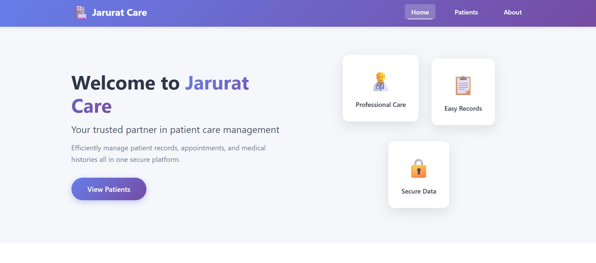
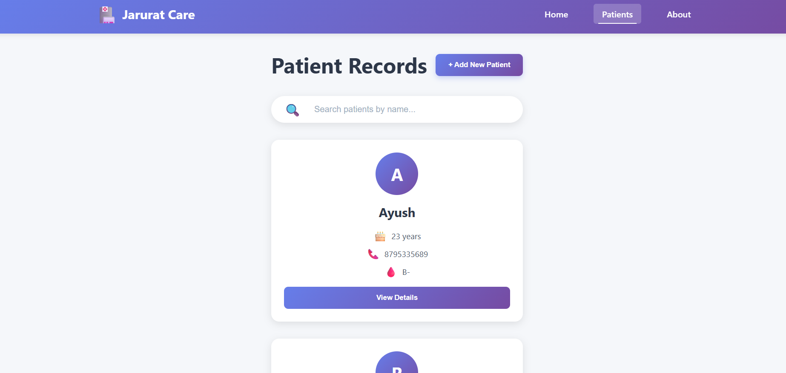
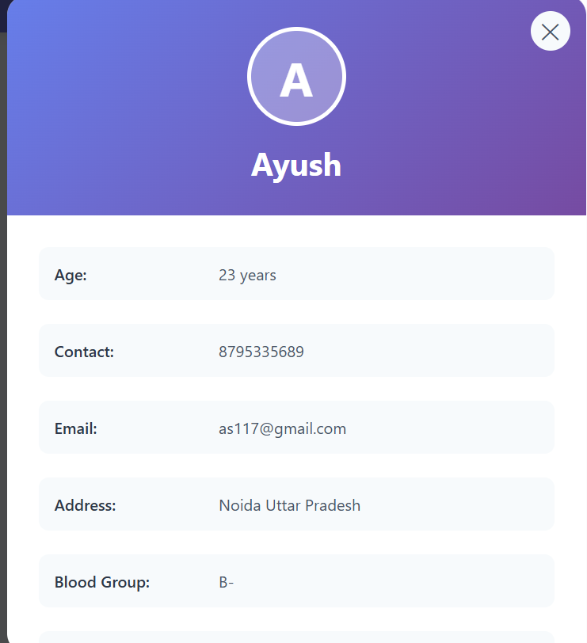
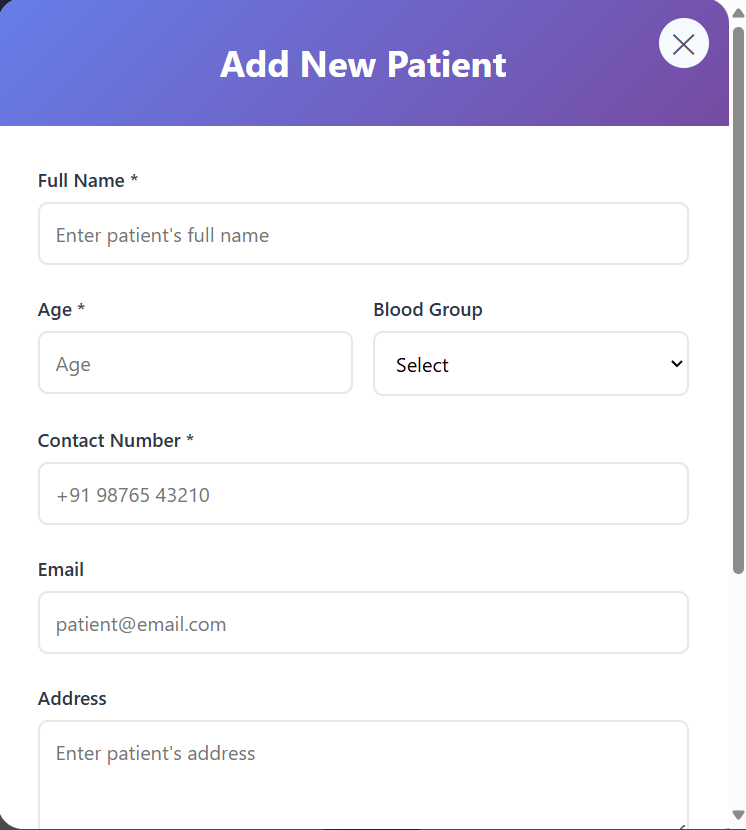

# Jarurat Care - Patient Records Dashboard

A modern, responsive patient records management system built with React.

 
## Features

- 🏥 **Landing Page** with professional design and navigation
- 📋 **Patient Management** with comprehensive patient records
- 🔍 **Search Functionality** to filter patients by name
- 📱 **Responsive Design** for desktop and mobile devices
- ➕ **Add New Patient** form with validation
- 🔄 **Loading & Error States** for better UX
- 💾 **Local State Management** using React Context API

## Tech Stack

- React 18
- React Router v6
- React Context API for state management
- CSS3 with custom animations
- Mock API for patient data

## Getting Started

### Prerequisites

- Node.js (v14 or higher)
- npm or yarn

### Installation


1. Install dependencies:
```bash
npm install
```

2. Start the development server:
```bash
npm start
```

3. Open [http://localhost:3000](http://localhost:3000) to view it in your browser.

## 📸 Screenshots

### Patients Dashboard


### Patient Details Modal


### Add New Patient Form
